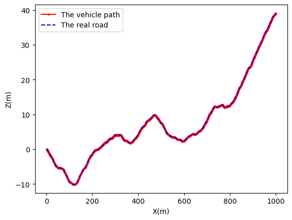

# Overview
This is the code sources of a DRL-based eco-driving control project. It aims to minimize the energy cost as well as hold the speed of a 4WID electric vehicle on stochastic road by controlling the toque of the front and rear motor. 
>The environment of road and vehicle driving is supported by env_simulink.py, with env.mdl being the simulatio of a vehicle and road_generator creat stochastic roads.

>The agent of ERL algorithm is supported by main_stbbsl.py. It use stablebaselines3 to train and test agents.

Also, this project support a control framework, where the total toque of front and rear engine is calculated by a PID controller, and the DRL algorithm is used to calculate the coefficient k that decide the distribution of the totol toque. For it, the environment of road and vehicle driving is supported by env_simulink_onedimension.py, with env_1D.mdl being the simulatio of a vehicle and road_generator creat stochastic roads.


## Result    
Below is the result of a DDPG agent demo.
Energy| Speed| Path
:-----------------------:|:-----------------------:|:-----------------------:|
| | 

## Dependencies
- gymnasium == 1.0.0  
- stablebaselines3 == 2.5.0  
- numpy == 2.1.2  
- torch == 2.6.0  

## Usage
```bash
python3 main_stbbsl.py
```
- You may use `Train` flag to specify whether to train your agent when it is `True` or test it when the flag is `False`.  
- You may use `TRAIN_PREVIOUS_MODEL` flag to specify whether to train a new model or continue the train a previous model.

## Reference
1. [The website of stable baselines3.](https://stable-baselines3.readthedocs.io/en/master/)

## Honorcode
1. https://ww2.mathworks.cn/help/releases/R2024b/sd1/ug/vehicle-with-four-wheel-drive.html
